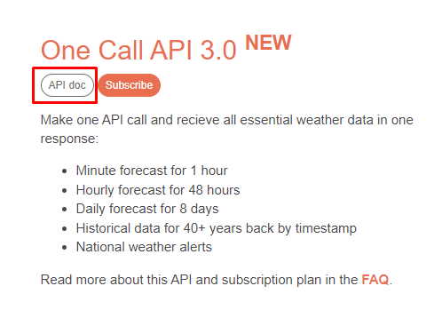

# weather forecast

project carried out in the week you programmer
In addition to using HTML, CSS and JavaScript, the website API [https://openweathermap.org/](https://openweathermap.org/) was used

To use the API, you first need to create an account, after a key is generated with it, it will be possible to use the information, in addition, the One Call API 3.0 API documentation from the website itself was used

## Project

## Tech

